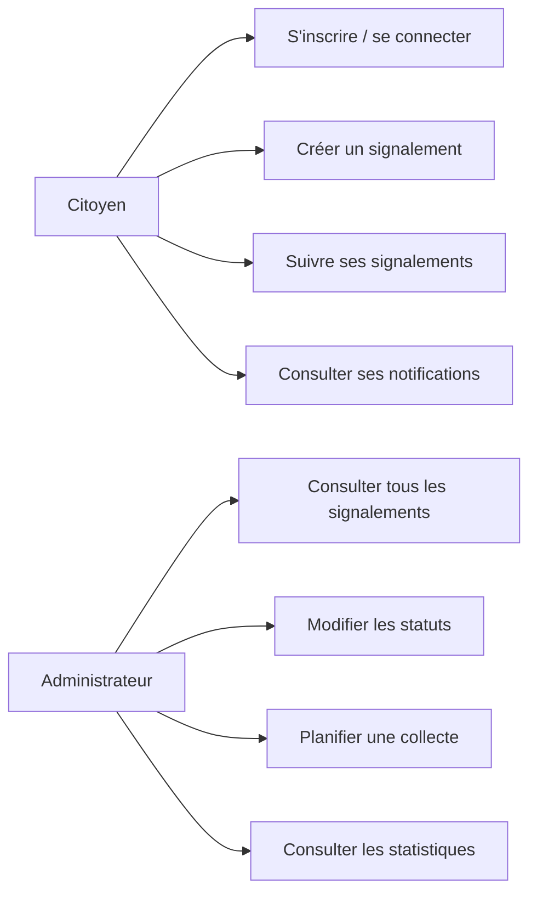
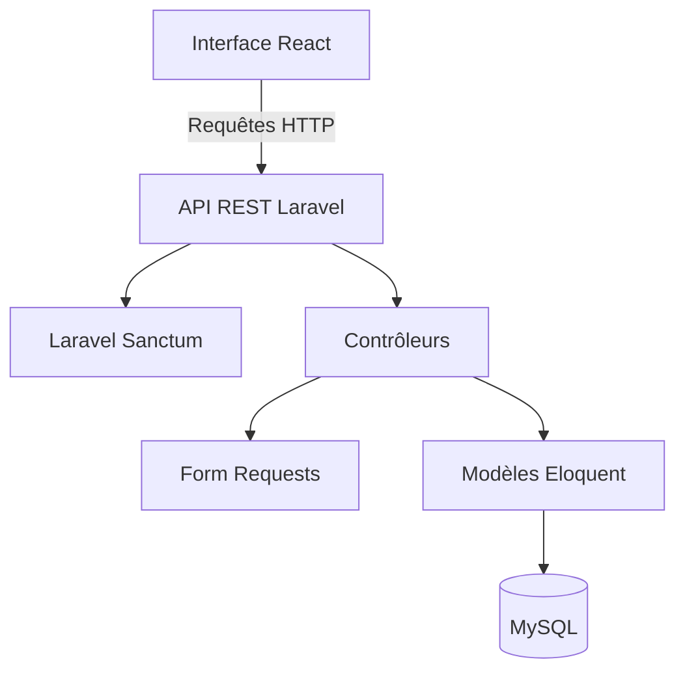

# Rapport technique — EcoSignal CI

## 1. Contexte et problématique

La gestion des dépôts sauvages de déchets nécessite une remontée rapide de l’information, une traçabilité des actions et une coordination entre les citoyens et les équipes de collecte. EcoSignal CI propose une plateforme numérique permettant de signaler un dépôt, d’en suivre le traitement et d’informer le citoyen des actions engagées.

## 2. Objectifs

L’application vise à :

- faciliter la déclaration des dépôts de déchets ;
- garantir qu’un citoyen consulte uniquement ses données ;
- permettre à l’administrateur de piloter le traitement des signalements ;
- planifier les collectes et informer automatiquement le citoyen ;
- produire des indicateurs simples par statut et par commune.

## 3. Acteurs et cas d’utilisation

### Citoyen

- créer un compte ;
- se connecter et se déconnecter ;
- créer un signalement ;
- consulter ses signalements ;
- consulter ses notifications ;
- consulter les conseils écologiques.

### Administrateur

- consulter tous les signalements ;
- modifier leur statut ;
- supprimer un signalement ;
- planifier ou terminer une collecte ;
- publier un conseil ;
- consulter les statistiques.



## 4. Besoins fonctionnels

| Référence | Besoin | Priorité |
|---|---|---|
| BF01 | Inscription et connexion | Haute |
| BF02 | Création d’un signalement | Haute |
| BF03 | Consultation des signalements personnels | Haute |
| BF04 | Gestion des statuts par l’administrateur | Haute |
| BF05 | Planification d’une collecte | Haute |
| BF06 | Notification du citoyen | Moyenne |
| BF07 | Conseils écologiques | Moyenne |
| BF08 | Statistiques globales | Moyenne |

## 5. Besoins non fonctionnels

- **Sécurité :** authentification Sanctum, contrôle du rôle et isolation des données.
- **Robustesse :** validation serveur, gestion cohérente des erreurs HTTP et transactions lors de la création d’une collecte.
- **Maintenabilité :** séparation du frontend en composants, pages et services ; séparation du backend en contrôleurs et Form Requests.
- **Performance :** pagination des listes et chargement ciblé des relations.
- **Compatibilité :** API JSON indépendante du client web.

## 6. Architecture technique



### Choix techniques

- **React :** construction d’une interface réactive à composants réutilisables.
- **Laravel :** API REST, validation, ORM Eloquent, migrations et tests intégrés.
- **Sanctum :** authentification par jetons pour le frontend séparé.
- **MySQL :** stockage relationnel des utilisateurs, signalements, collectes et notifications.
- **PHPUnit :** tests automatisés du comportement de l’API.

## 7. Modèle de données

```mermaid
erDiagram
    USERS ||--o{ SIGNALEMENTS : cree
    USERS ||--o{ NOTIFICATIONS : recoit
    SIGNALEMENTS ||--o| COLLECTES : fait_objet

    USERS {
        bigint id PK
        string nom
        string prenom
        string email UK
        string password
        enum role
    }
    SIGNALEMENTS {
        bigint id PK
        bigint user_id FK
        string commune
        enum categorie
        text description
        string photo_path
        decimal latitude
        decimal longitude
        enum statut
    }
    COLLECTES {
        bigint id PK
        bigint signalement_id FK_UK
        date date_passage
        string equipe_assignee
        enum statut
    }
    NOTIFICATIONS {
        bigint id PK
        bigint user_id FK
        string titre
        text message
        boolean lue
    }
```

La contrainte d’unicité sur `collectes.signalement_id` empêche la création de plusieurs collectes pour un même signalement.

## 8. Sécurité et autorisations

Les routes de création et de consultation des signalements utilisent `auth:sanctum`. Les opérations sensibles sont également protégées par le middleware `admin`.

Un citoyen ne reçoit que les signalements associés à son propre `user_id`. Un administrateur peut consulter l’ensemble des signalements. Le rôle administrateur ne peut pas être choisi lors de l’inscription publique.

## 9. Gestion des erreurs

L’API utilise les codes suivants :

| Code | Signification |
|---|---|
| 200 | Requête réussie |
| 201 | Ressource créée |
| 401 | Authentification requise ou identifiants invalides |
| 403 | Action interdite pour le rôle courant |
| 404 | Ressource inexistante |
| 422 | Données de formulaire invalides |

Le frontend transforme les réponses d’erreur en messages visibles et exploite les erreurs de validation retournées par Laravel.

## 10. Stratégie de tests

Les tests backend utilisent `RefreshDatabase` et SQLite en mémoire. Chaque test repart d’une base propre.

| Test | Résultat attendu |
|---|---|
| Inscription valide | Utilisateur citoyen créé, code 201 et jeton retourné |
| Email déjà utilisé | Code 422 et erreur sur `email` |
| Connexion valide | Code 200 et jeton retourné |
| Connexion invalide | Code 401 |
| Création sans connexion | Code 401 |
| Création par un citoyen | Signalement relié à son identifiant |
| Consultation citoyenne | Seuls ses signalements sont retournés |
| Consultation administrateur | Tous les signalements sont retournés |
| Modification par un citoyen | Code 403 |
| Modification par un administrateur | Statut mis à jour |
| Planification d’une collecte | Collecte créée, statut en cours et notification créée |
| Deuxième collecte identique | Code 422 |
| Consultation des notifications | Seules les notifications du compte sont retournées |

### Commandes d’exécution

```bash
php artisan test
cd frontend && npm test -- --watchAll=false
```

## 11. Améliorations réalisées

- suppression de l’utilisateur fictif `demo@ecosignal.ci` ;
- ajout des routes d’authentification ;
- protection des routes de gestion ;
- ajout des routes de collectes et de notifications ;
- correction de la factory utilisateur ;
- ajout de validations spécialisées ;
- ajout de la pagination ;
- ajout du téléversement de photo et de la géolocalisation facultative ;
- séparation du frontend en pages, composants et service API ;
- remplacement du test React par défaut ;
- création d’une documentation d’installation et de tests.

## 12. Limites et perspectives

Les évolutions possibles comprennent une carte interactive, une recherche géographique avancée, un historique complet des changements de statut, l’envoi de notifications par email ou SMS, l’export des statistiques et un déploiement automatisé.

## Conclusion

La version corrigée d’EcoSignal CI constitue une application cohérente, sécurisée et mieux documentée. Les fonctionnalités sont désormais reliées entre elles et les tests couvrent les principaux risques fonctionnels et d’autorisation.
